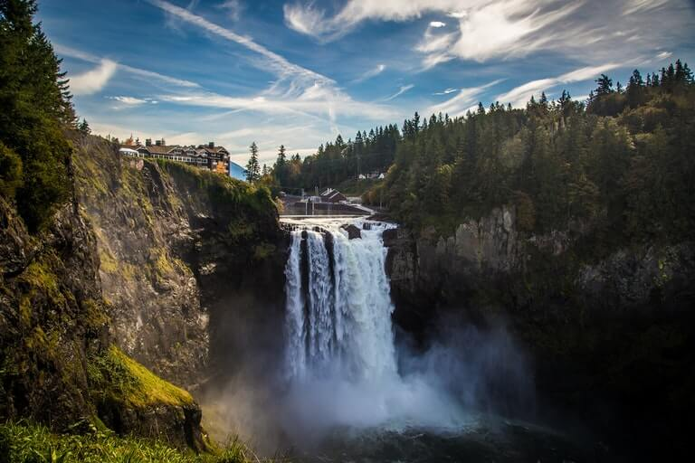

# Tourism and Travel Web GIS Project

  *The Tourism and Travel Web GIS project is a comprehensive platform designed to assist travelers and staycation seekers in Washington State. With a focus on interactive maps, transportation information, and user reviews, this project aims to provide a unique and personalized travel experience. Inspired by the need to uncover local areas and hidden gems, the platform aims to move beyond mainstream tourism and offer a deeper exploration of Washington State.*

## Section 1
*In Washington State, there is a wealth of captivating landscapes, cultural landmarks, and vibrant communities that often remain unnoticed by traditional tourist guides. Through interactive maps, users can discover lesser-known destinations and attractions that showcase the true essence of the state. Detailed transportation information ensures seamless journey planning, catering to different preferences such as public transportation or rental cars.*

## Section 2
*Through the Tourism and Travel Web GIS project, I hope to inspire a sense of adventure and discovery in travelers, encouraging them to explore the richness and diversity of Washington State beyond the conventional tourist hotspots. By offering a platform that showcases the lesser-known aspects of the state, we aim to create unforgettable experiences and connect travelers with the hidden treasures that make Washington State truly unique.*

## Section 3
*The core objective of the Tourism and Travel Web GIS project is to inspire a spirit of adventure and discovery in travelers, encouraging them to step off the beaten path. By shedding light on the lesser-known aspects of Washington State, the project creates unforgettable experiences and connects travelers with the hidden treasures that make the state truly exceptional.*

## Key Features:

* Interactive maps for exploring and discovering lesser-known destinations.
* Comprehensive transportation information for seamless journey planning.
* User reviews and recommendations for authentic local experiences.
* Personalized trip itineraries based on individual preferences.
* Emphasis on off-the-beaten-path exploration and hidden gems.

## See also
- [Washington State Tourism](https://stateofwatourism.com)
- [Eco Tourism](https://harborwildwatch.org/resources/eco-tourism/)
- [Port of Seattle](https://www.portseattle.org/page/washington-state-travel-recommendations)
  

## References
1. [Reference 1](https://www.igismap.com/gis-for-travels-and-tourism/)
2. [Reference 2](https://wisconsindot.gov/pages/doing-bus/mapsgis.aspx)
3. [Reference 3](https://gisfortourism.wordpress.com)